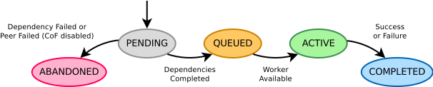
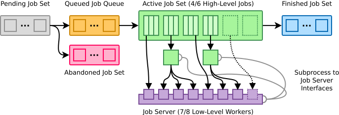
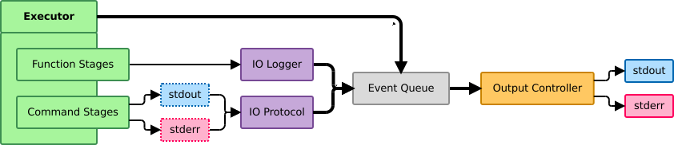

The Catkin Execution Engine
===========================

One of the core modules in ``catkin_tools`` is the **job executor**.
The executor performs jobs required to complete a task in a way that maximizes (or achieves a specific) resource utilization subject to job dependency constraints.
The executor is closely integrated with logging and job output capture.
This page details the design and implementation of the executor.

Execution Model
^^^^^^^^^^^^^^^

The execution model is fairly simple.
The executor executes a single **task** for a given command (i.e.
``build``, ``clean``, etc.).
A **task** is a set of **jobs** which are related by an acyclic dependency graph.
Each **job** is given a unique identifier and is composed of a set of dependencies and a sequence of executable **stages**, which are arbitrary functions or sub-process calls which utilize one or more **workers** to be executed.
The allocation of workers is managed by the **job server**.
Throughout execution, synchronization with the user-facing interface and output formatting are mediated by a simple **event queue**.

The executor is single-threaded and uses an asynchronous loop to execute jobs as futures.
If a job contains blocking stages it can utilize a normal thread pool for execution, but is still only guaranteed one worker by the main loop of the executor.
See the following section for more information on workers and the job server.

The input to the executor is a list of topologically-sorted jobs with no circular dependencies and some parameters which control the job server behavior.
These behavior parameters are explained in detail in the following section.

Each job is in one of the following life-cycle states at any time:

  - ``PENDING`` Not ready to be executed (dependencies not yet completed)
  - ``QUEUED`` Ready to be executed once workers are available
  - ``ACTIVE`` Being executed by one or more workers
  - ``FINISHED`` Has been executed and either succeeded or failed (terminal)
  - ``ABANDONED`` Was not built because a prerequisite was not met (terminal)

   **Executor Job Life-cycle**

All jobs begin in the ``PENDING`` state, and any jobs with unsatisfiable dependencies are immediately set to ``ABANDONED``, and any jobs without dependencies are immediately set to ``QUEUED``.
After the state initialization, the executor processes jobs in a main loop until they are in one of the two terminal states (``FINISHED`` or ``ABANDONED``).
Each main loop iteration does the following:

  - While job server tokens are available, create futures for ``QUEUED`` jobs     and make them ``ACTIVE`` 
  - Report status of all jobs to the event queue
  - Retrieve ``ACTIVE`` job futures which have completed and set them     ``FINISHED`` 
  - Check for any ``PENDING`` jobs which need to be ``ABANDONED`` due to failed     jobs 
  - Change all ``PENDING`` jobs whose dependencies are satisfied to ``QUEUED``

Once each job is in one of terminal states, the executor pushes a final status event and returns.

Job Server Resource Model
^^^^^^^^^^^^^^^^^^^^^^^^^

As mentioned in the previous section, each task includes a set of jobs which are activated by the **job server**.
In order to start a queued job, at least one worker needs to be available.
Once a job is started, it is assigned a single worker from the job server.
These are considered **top-level jobs** since they are managed directly by the catkin executor.
The number of top-level jobs can be configured for a given task.

Additionally to top-level parallelism, some job stages are capable of running in parallel, themselves.
In such cases, the job server can interface directly with the underlying stage's low-level job allocation.
This enables multi-level parallelism without allocating more than a fixed number of jobs.

   **Executor Job Flow and Resource Utilization** -- In this snapshot of the job pipeline, the executor is executing four of six possible top-level jobs, each with three stages, and using seven of eight total workers. Two jobs are executing sub-processes, which have side-channel communication with the job server.

One such parallel-capable stage is the GNU Make build stage.
In this case, the job server implements a GNU Make job server interface, which involves reading and writing tokens from file handles passed as build flags to the Make command.

For top-level jobs, additional resources are monitored in addition to the number of workers.
Both system load and memory utilization checks can be enabled to prevent overloading a system.

Executor Job Failure Behavior
^^^^^^^^^^^^^^^^^^^^^^^^^^^^^

The executor's behavior when a job fails can be modified with the following two parameters: 

  - ``continue_on_failure`` Continue executing jobs even if one job fails.
    If this is set to ``false`` (the default), it will cause the executor to abandon all pending and queued jobs and stop after the first failure.
    Note that active jobs will still be allowed to complete before the executor returns.
  - ``continue_without_deps`` Continue executing jobs even if one     or more of their dependencies have failed.
    If this is set to ``false`` (the default), it will cause the executor to abandon only the jobs which depend on the failed job.
    If it is set to ``true``, then it will build dependent jobs regardless.

Jobs and Job Stages
^^^^^^^^^^^^^^^^^^^

As mentioned above, a **job** is a set of dependencies and a sequence of **job stages**.
Jobs and stages are constructed before a given task starts executing, and hold only specifications of what needs to be done to complete them.
All stages are given a label for user introspection, a logger interface, and can either require or not require allocation of a worker from the job server.

Stage execution is performed asynchronously by Python's ``asyncio`` module.
This means that exceptions thrown in job stages are handled directly by the executor.
It also means job stages can be interrupted easily through Python's normal signal handling mechanism.

Stages can either be **command stages** (sub-process commands) or **function stages** (python functions).
In either case, loggers used by stages support segmentation of ``stdout`` and ``stderr`` from job stages for both real-time introspection and logging.

Command Stages
~~~~~~~~~~~~~~~

In addition to the basic arguments mentioned above, command stages are parameterized by the standard sub-process command arguments including the following: 

  - The command, itself, and its arguments,
  - The working directory for the command,
  - Any additional environment variables,
  - Whether to use a shell interpreter
  - Whether to emulate a TTY
  - Whether to partition ``stdout`` and ``stderr``

When executed, command stages use ``asyncio``'s asynchronous process executor with a custom I/O protocol.

Function Stages
~~~~~~~~~~~~~~~

In addition to the basic arguments mentioned above, function stages are parameterized by a function handle and a set of function-specific Python arguments and keyword arguments.
When executed, they use the thread pool mentioned above.

Since the function stages aren't sub-processes, I/O isn't piped or redirected.
Instead, a custom I/O logger is passed to the function for output.
Functions used as function stages should use this logger to write to ``stdout`` and ``stderr`` instead of using normal system calls.

Introspection via Executor Events
^^^^^^^^^^^^^^^^^^^^^^^^^^^^^^^^^

Introspection into the different asynchronously-executed components of a task is performed by a simple event queue.
Events are created by the executor, loggers, and stages, and they are consumed by an output controller.
Events are defined by an event identifier and a data payload, which is an arbitrary dictionary.

There are numerous events which correspond to changes in job states, but events are also used for transporting captured I/O from job stages.

   **Executor Event Pipeline** -- Above, the executor writes events to the event queue, and the I/O loggers used by function and command stages write output events as well. All of these events are handled by the output controller, which writes to the real ``stdout`` and ``stderr``.

The modeled events include the following:

  - ``JOB_STATUS``  A report of running job states,
  - ``QUEUED_JOB``  A job has been queued to be executed,
  - ``STARTED_JOB``  A job has started to be executed,
  - ``FINISHED_JOB``  A job has finished executing (succeeded or failed),
  - ``ABANDONED_JOB``  A job has been abandoned for some reason,
  - ``STARTED_STAGE``  A job stage has started to be executed,
  - ``FINISHED_STAGE``  A job stage has finished executing (succeeded or failed),
  - ``STAGE_PROGRESS``  A job stage has executed partially,
  - ``STDOUT``  A status message from a job,
  - ``STDERR``  A warning or error message from a job,
  - ``SUBPROCESS`` A sub process has been created,
  - ``MESSAGE``  Arbitrary string message
